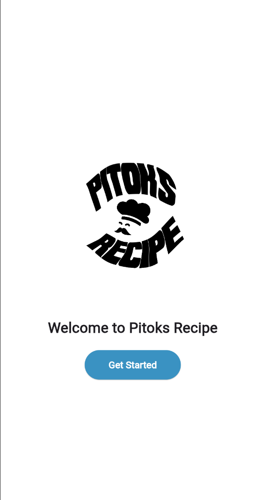

# PitoksRecipeApp
Pitoks Recipe is a user-friendly app that helps users discover and cook delicious meals from around the world. Features include recipe search and filters, detailed ingredients and instructions, nutritional information, a meal planner, grocery list generator, portion control, dietary preferences, reminders, and export/share options.


# Pitoks Recipe App 

Pitoks Recipe is a user-friendly and engaging recipe app that helps users discover and cook delicious meals from around the world.
Whether you're a seasoned chef or a beginner, our app has something for everyone. 

Features:

1. Recipe Search and Filters 
- Easily search for recipes by cuisine, dietary needs, or available ingredients. 
- Filter recipes based on categories such as Lamb, Chicken, Beef, Vegetables, Cereal, Carbohydrates, Seafood, Desserts, and Snacks. 

2. Recipe Categories 
- Organized recipes into various categories for easy navigation. 

3. Ingredients and Instructions 
- Detailed list of ingredients and step-by-step instructions for each recipe. 

4. Nutritional Information 
- Provides nutritional information for each recipe. 

5. Meal Planner 
- Plan your meals for the week with the meal planner feature. 
- Add recipes to specific meal slots, generate a grocery list, and adjust serving sizes. 

6. Grocery List Generator 
- Automatically generate a grocery list based on the recipes added to the meal planner. 
- Editable list to add, remove, or mark items as bought. ### 7. Portion Control 
- Adjust serving sizes for each recipe, and the ingredients will be updated accordingly. 

8. Quick Add Meals 
- Add meals without selecting a recipe using the quick add feature.

9. Dietary Preferences 
- Filters for various dietary preferences such as vegetarian, vegan, and gluten-free. 

10. Reminders and Notifications 
- Set meal prep alerts and grocery alerts. 

11. Export/Share Options 
- Export your meal plan as a PDF or image and share it with family or roommates.

Screenshots     Getting Started ### Prerequisites - Flutter SDK - Dart SDK ### Installation 
1. Clone the repository: ```sh git clone https://github.com/yourusername/pitoks-recipe-app.git ```
2. Navigate to the project directory: ```sh cd pitoks-recipe-app ```
3. Install dependencies: ```sh flutter pub get ```
4. Run the app: ```sh flutter run ```

Contributing Contributions are welcome! Please fork the repository and submit a pull request. 
License This project is licensed under the MIT License. ## Authors - **Shaun Belono-ac** - UI/UX Designer - **Boss Zata** - Lead Developer ## Acknowledgments - Special thanks to the Flutter community for their support and resources.
